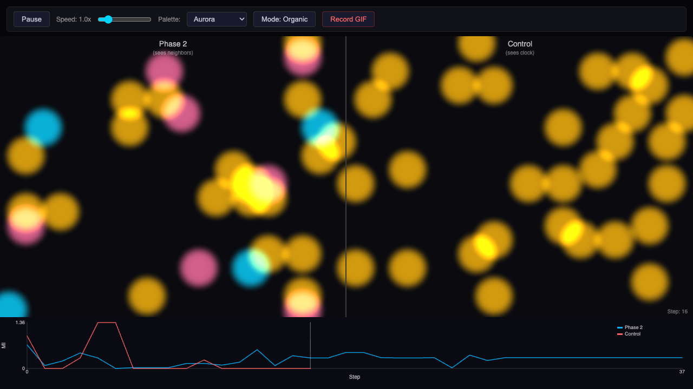

# Objectless ALife Visualization

A p5.js web app for visualizing agent-based simulations side-by-side.

## Quick Start

```bash
# Generate sample data
mkdir -p viz/data
uv run python -m src.export_web paired \
  --phase2-dir data/stage_d/phase_2 \
  --control-dir data/stage_d/control \
  --sim-seed 0 \
  --output viz/data/demo.json

# Install dependencies and start dev server
cd viz && bun install && bun run dev
# Open http://localhost:3000?paired=data/demo.json
```

## Interpreting the Visualization



### Controls (top bar)

Pause/Play, speed slider, color palette selector, render mode toggle (Organic = blurred blobs), and GIF recorder.

### Two Grids (side-by-side)

- **Left ("Phase 2")** — Agents following a Phase 2 lookup rule (100-entry observation table). Each colored blob is an agent; the 4 colors map to the 4 possible states. "Organic" mode applies a blur effect, making clusters visually prominent.
- **Right ("Control")** — Agents following a random Control rule (also 100-entry table). Same initial seed (`sim-seed 0`), so both simulations start from identical agent positions — differences emerge purely from the rules.

### MI Overlay Chart (bottom)

- **Blue line** = Phase 2 mutual information over time
- **Red line** = Control mutual information over time
- X-axis = simulation step, Y-axis = MI value

If Phase 2's blue line stays consistently above Control's red line, the Phase 2 rule produces more spatial coordination than random chance.

### What to Look For

- Phase 2 grid shows more visible **clustering** (agents of the same color grouping together)
- Control grid appears more **scattered/random**
- The MI chart quantifies this — higher MI means agent states are more spatially correlated with their neighbors
